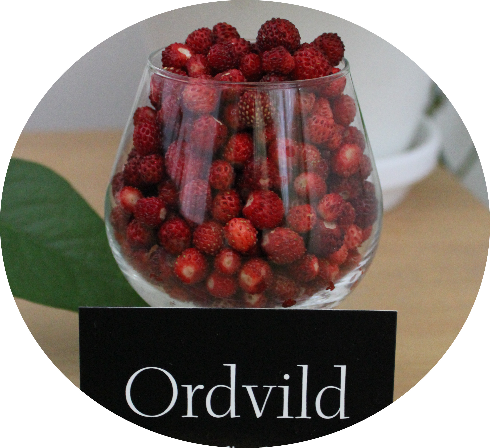

 
# Väkommen till Ordvild!

Jag älskar ord, text och språk. En bokmal och ordnörd, vars favoritord är *förvisso*…

## Vilda ord, texter och tankar

Mitt favoritmedium har alltid varit det skrivna ordet. Jag både läser och skriver egna texter och artiklar på vilda teman – vilda som i naturliga, spännande, komplexa, smarta, okonventionella, banbrytande, intressanta, originella, frigörande, intelligenta och stimulerande.

Artiklar om fötter som jag skrev kring 2020:

- [Den raska promenadens död](http://ordvild.se/den-raska-promenadens-dod)
- [Att upptäcka springningen](http://ordvild.se/att-upptacka-springningen)
- [Vandringens återkomst](http://ordvild.se/vandringens-aterkomst)
- [Frigör dina fötter, kvinna!](http://ordvild.se/frigor-dina-fotter-kvinna)

Nyligen har jag skrivit en [Bastumanual](http://ordvild.se/bastumanual) för en närståendes finska bastu.

## Ordvild korrektur och språkgranskning

Ibland frilansar jag och donerar min tid till personer och verksamheter som jag tror på. Då erbjuder jag korrekturläsning och språkgranskning av bokmanus, artiklar, produktbeskrivningar och nyhetsbrev med mera. Jag riktar särskilt in mig på fristående, självpublicerande författare samt småföretag och organisationer.

Kvalitet, enkelhet och fantasi är mina ledstjärnor.

Nyligen hade jag nöjet att få donera min tid till [Sofiainstitutet](https://sofiainstitutet.se/) och vara redaktör för det spännande forskningsdokumentet [I modern, valan och den heliga hästens spår](https://www.academia.edu/128838145/I_modern_valan_och_den_heliga_h%C3%A4stens_sp%C3%A5r_Agneta_Nyholm_Sofiainstitutet_20250417_lkd).

### Referenser

> Att använda Sara som redaktör och korrekturläsare till min bok om ledarskap har varit fantastiskt. Att hon är bra på det skrivna språket är en sak men hon är klarsynt, kompetent och grymt skicklig på att ge relevant feedback och kan se var saker behöver bli bättre, och den saken höjer värdet på hennes insatser avsevärt. Hon är verkligen en ovärderlig pärla för oss författare.
> – Agneta Nyholm, författare, föreläsare och grundare till [Sofiainstitutet](https://sofiainstitutet.se/) och School of Graceful Living

> Så ska en text skrivas!
> – Sebastian, [FreeFoot](https://freefoot.se/), om min artikel Den raska promenadens död

> Sara med företaget Ordvild, civilingenjör i tillämpad hållbarhet och industriell ekologi, var med och granskade boken. I kombination med din nuvarande verksamhet inom textgranskning blev du den ideala korrekturläsaren. Tack!
> – Nikolas och Ingrid Berg och Martin Hultman, författare till [Naturens rättigheter](https://naturensrattigheter.se/2020/03/24/boken-naturens-rattigheter-att-skapa-fred-med-jorden/)

> Ditt korrektur av mitt examensarbete är fortfarande det bästa korrekturet jag fått i min karriär.
> – Markus Millinger, disputerad forskare inom bioenergi

> Dina kommentarer på min uppsats i demografi var precis vad jag behövde för att komma vidare!
> – Johan, student och yrkesarbetande

### Kontakt

Tankar eller förslag på samarbeten skickas till: *ordvild [snabel-a] pm [punkt] me*

Copyright © 2024 Ordvild
