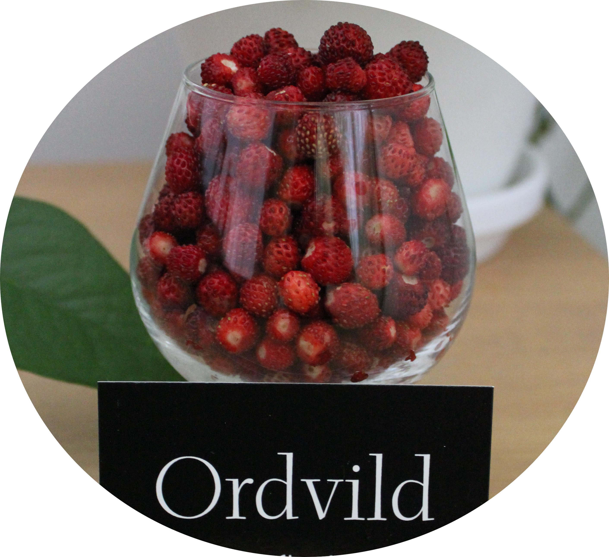

 
# Väkommen till Ordvild!

Jag älskar ord, text och språk. En bokmal och ordnörd, vars favoritord är *förvisso*…

## Vilda ord, texter och tankar

Mitt favoritmedium har alltid varit det skrivna ordet. Jag både läser och skriver (ibland) egna texter och artiklar på vilda teman – vilda som i naturliga, spännande, komplexa, smarta, okonventionella, banbrytande, intressanta, originella, frigörande, intelligenta och stimulerande.

Artiklar om fötter som jag skrev kring 2020:

- [Den raska promenadens död](http://ordvild.se/den-raska-promenadens-dod)
- [Att upptäcka springningen](http://ordvild.se/att-upptacka-springningen)
- [Vandringens återkomst](http://ordvild.se/vandringens-aterkomst)
- [Frigör dina fötter, kvinna!](http://ordvild.se/frigor-dina-fotter-kvinna)

Under 2024 tog jag fram en [Bastumanual](http://ordvild.se/bastumanual) för en närståendes finska, vedeldade bastu.

## Ordvild korrektur och språkgranskning

Tidigare frilansade jag och erbjöd språkgranskning och redaktörstjänster av bokmanus och artiklar med mera åt fristående, självpublicerande författare samt småföretag och organisationer. Under 2025 hade jag nöjet att få donera min tid till [Sofiainstitutet](https://sofiainstitutet.se/) och vara redaktör för upplaga 11–14 av det spännande forskningsdokumentet [I modern, valan och den heliga hästens spår](https://sofiainstitutet.se/wp-content/uploads/2026/02/I-modern-valan-och-den-heliga-hastens-spar-Agneta-Nyholm-Sofiainstitutet-20251003-fullsize-compressed.pdf). Jag var även med under 2020 och granskade boken [Naturens rättigheter](https://naturensrattigheter.se/2020/03/24/boken-naturens-rattigheter-att-skapa-fred-med-jorden/).

Just nu tar jag inte frilansuppdrag utan jobbar som teknisk skribent inom IT och skriver dokumentation och tekniska manualer på dagarna.

> För en samlad skribentportfölj, se [Writing portfolio](http://ordvild.se/writing-portfolio).

Kvalitet, enkelhet och fantasi är mina ledstjärnor.

---

Copyright © 2024 Ordvild
